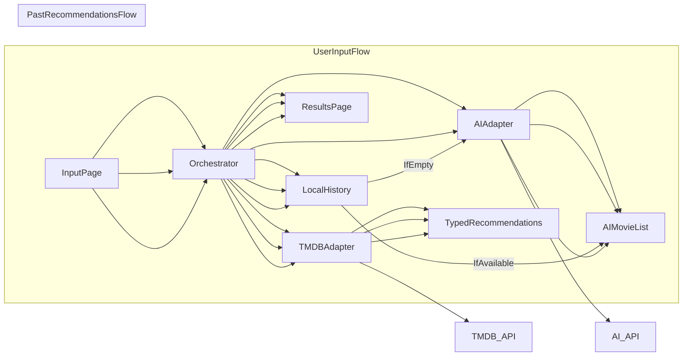

# High-Level Design

## Project Rules
See `docs/Rules.md` for the project-wide constraints and working rules.

## Problem Statement
Build a simple, AI-powered movie recommendation app that interprets a user's short text input, blends it with lightweight preferences (genre and age suitability), and returns personalized recommendations with basic movie metadata, while remaining free-tier only and device-local.

## Goals
- Provide a concise input form (50-75 characters) plus genre and age suitability filters.
- Generate AI-based recommendations personalized to the user's input text.
- Show basic metadata for each recommendation (e.g., link, rating, genre).
- Offer a "similar to past recommendations" flow using device-local history.
- Keep the app simple, focusing on core functionality for the initial release.

## Non-Goals (Phase 1)
- No user accounts, login, or cloud-synced profiles.
- No complex ranking systems beyond AI-provided suggestions.
- No multi-region availability or internationalization.
- No paid APIs or paid infrastructure beyond free tiers.

## Functional Requirements
- **Input form**
  - Text input limited to 50-75 characters.
  - Genre selector (dropdown).
  - Age control: family friendly, kid friendly, mature.
  - Two actions:
    - Search using the current input and filters.
    - Recommend based on the last recommendation set; if none, use trending.
- **Recommendations**
  - AI takes the user input and generates a prompt to produce personalized movie suggestions.
  - For each movie, show title, poster, short summary (if available), rating, genre, and a metadata link (e.g., TMDB page).
- **Results presentation**
  - Two-page flow: input page → results page.
  - Results page supports back navigation to adjust inputs.
- **History**
  - Store the last recommendation set locally on device.

## Constraints
- Free-tier only for all external services.
- All data sources must be credible, production-ready, and documented.

## Assumptions
- Primary movie metadata and trending data from TMDB (free tier).

## High-Level Architecture
The app uses an orchestrator pattern to keep UI and business logic separated. The UI triggers flows, while the orchestrator coordinates adapters for AI and TMDB, plus local history.

